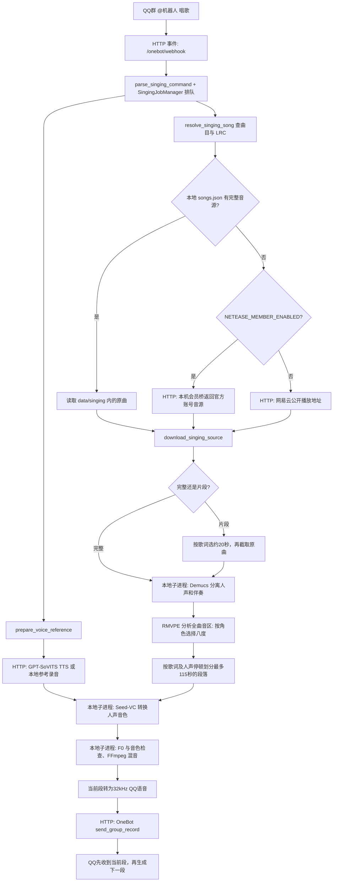

# AI 翻唱（本地 Seed-VC）

AI 翻唱走独立本地后端：Demucs `htdemucs_ft` 先从原曲分离人声，Seed-VC v1 的 F0 44.1 kHz 模型转换人声音色，保留旋律间隔和节奏，也可按角色调整整体音区，再与伴奏混合。现有 GPT-SoVITS 角色权重用于文字转语音，不能直接作为这个歌声转换模型。

运行依赖、Seed-VC 源码、原始录音、训练集、检查点和候选登记都保存在 `data/singing/`。该目录受 Git 忽略；不要将源录音、模型检查点或拆分出的人声提交到 GitHub。旧 GPT-SoVITS 环境只提供 CUDA PyTorch 导入路径，安装脚本会把其它依赖放在单独的歌声运行环境中，不修改 `.env` 或旧环境。

## 请求如何流转



| 代码中的名字 | 中文含义 | 通信边界 |
| --- | --- | --- |
| `onebot_webhook` | 收到 QQ 群事件的入口 | NapCat 向本地 FastAPI 发 HTTP 请求 |
| `SingingJobManager` | 控制翻唱排队、冷却与取消 | 机器人进程内管理；同一时间只放行一个 GPU 任务 |
| `resolve_singing_song` / `download_singing_source` | 确认歌曲、时间轴歌词和完整原曲；取得原曲文件 | 优先读取 `data/singing/` 本地文件；否则按设置访问网易云公开接口，或本机会员桥获取官方账号音源 |
| `get_member_song_payload` / `bridge.cjs` | 读取会员歌曲地址 / 本机账号桥接服务 | Python 通过带本机令牌的 HTTP 请求访问 Node；Node 用本机保存的登录信息请求网易云 |
| `prepare_voice_reference` | 准备角色音色参考录音 | 调用 GPT-SoVITS HTTP TTS，或读取角色已配置的本地录音 |
| `choose_octave_shift` / `plan_singing_pitch` | 选择八度偏移 / 分析歌曲音区 | 纯 NumPy 规则与独立 RMVPE 子进程，在 −12、0、+12 半音中选择 |
| `convert_vocals` | 根据原唱人声的旋律转换音色 | 启动本地 Seed-VC 子进程；已验收微调权重作为可选输入 |
| `check_cover_quality` | 检查音高、音色、时长与音量，失败时可重试一次 | 启动本地 RMVPE/CAMPPlus 检查脚本，读取 JSON 报告 |
| `select_singing_excerpt` / `plan_paused_sections` | 选几句歌词 / 在人声停顿处分段 | 在本机分析时间轴和低能量停顿；连续覆盖选定范围，单段最多 115 秒 |
| `vocal_clarity_filter` / `vocal_forward_mix_filter` | 整理人声 / 混音 | 先轻微提亮、压缩，再测实际电平补人声增益；伴奏固定增益，没有侧链压低或噪声门 |
| `send_group_record` | 按顺序发送各段语音 | 机器人向 NapCat OneBot HTTP Server 发请求 |

## 启用与群聊用法

搜歌会同时匹配网易云登记的原名、别名和译名，歌手仍作为筛选条件。比如 `翻唱茉子 monitoring 初音ミク` 或 `翻唱茉子 Monitoring / 初音ミク`；多个空格也可以。受理时“搜索”显示输入词，找到歌曲后才显示实际歌名，不会把歌手当成歌名的一部分。

不确定歌名时，先点歌确认曲目；相近译名没有登记在网易云里时，补上原名和歌手更可靠。

安装完成后，在 `.env` 设置 `SINGING_ENABLED=true`。默认运行路径由 `SINGING_PYTHON`、`SINGING_SEED_ROOT`、`SINGING_FFMPEG_PATH`、`SINGING_FFPROBE_PATH` 指定；默认值见 `.env.example`。翻唱参考优先级为已配置的翻唱专用参考 → 角色原始本地录音 → GPT-SoVITS 训练音色合成短句。原始录音优先由 `SINGING_PREFER_RECORDED_REFERENCE=true` 控制；需要强制使用训练 TTS 的角色参考时设为 `false`，保持 `SINGING_USE_TRAINED_TTS_REFERENCE=true` 并确保原有语音服务可用。

丛雨默认以真实游戏录音作为翻唱参考，由 `SINGING_REAL_REFERENCE_PROFILE_IDS=murasame` 指定。其它角色仍遵循上述 TTS 参考设置。为翻唱单独选择录音时，可设置 `SINGING_REFERENCE_AUDIO_BY_PROFILE_JSON`，例如 `{"murasame":"data/singing/acceptance/cute-references/murasame_soft_affection_0055_mono44k.wav"}`；路径相对项目根目录，此设置仅供翻唱使用。

参考尽量选干净的原录音，别把上次转换的歌声重新用作参考，免得失真一轮轮累积。默认只取前 8 秒；较短的参考也能给转换保留更多歌曲上下文。每个角色使用自己的参考，歌曲无需逐首训练。

微调后咬字变差时，可在 `SINGING_BASE_MODEL_PROFILE_IDS` 填对应角色 ID（逗号分隔），直接使用基础模型加原录音。已验收权重仍留在原处，移除此项即可恢复；新候选不会自动替换它。建议同一段歌声比较基础模型和微调模型，再决定用哪版。

| 主要 `.env` 项 | 默认值 | 作用 |
| --- | --- | --- |
| `SINGING_HF_OFFLINE` | `false` | 首次下载模型后可设为 `true`，避免每次转换重新向 Hugging Face 检查缓存；仅影响歌声模型加载 |
| `NETEASE_MEMBER_ENABLED` | `false` | `true` 时对未登记本地原曲的歌曲使用本机网易云会员桥；桥接登录或完整播放权限不可用时会报错，不改用第三方音源 |
| `SINGING_CHUNK_SECONDS` | `115` | 优先在原唱停顿处分段；没有停顿时用上限前最后一个歌词换句位置，段尾补短停顿 |
| `SINGING_CLIP_SECONDS` | `20` | 片段目标时长，优先取开头几句有效歌词，通常约 15–25 秒 |
| `SINGING_REFERENCE_MAX_SECONDS` | `8` | 参考录音最多取 8 秒，可设置 3–20 秒 |
| `SINGING_BASE_MODEL_PROFILE_IDS` | 空 | 指定角色使用基础转换模型；逗号分隔，原微调权重不删除 |
| `SINGING_PREFER_RECORDED_REFERENCE` | `true` | 优先角色原始录音，减少聊天 TTS 失真传入翻唱；已配置的翻唱专用参考仍优先 |
| `SINGING_ACCOMPANIMENT_GAIN` / `SINGING_VOCAL_BACKGROUND_GAP_DB` | `0.85` / `3` | 伴奏保持正常音量，人声目标根据伴奏电平提高；没有侧链压低乐器 |
| `SINGING_MIN_VOICED_RECALL` / `SINGING_MIN_ENERGY_RECALL` / `SINGING_MAX_MISSING_VOCAL_SECONDS` | `0.88` / `0.90` / `1.2` | 有声帧、活跃能量覆盖与局部近静音缺失检查；失败仅重试当前段 |
| `SINGING_MAX_SONG_SECONDS` | `600` | 原曲实际时长上限，超出时停止 |
| `SINGING_MAX_SOURCE_BYTES` | `104857600` | 本地或网易云原曲大小上限（100 MiB） |
| `SINGING_QUEUE_SIZE` / `SINGING_COOLDOWN_SECONDS` | `3` / `120` | 待处理队列和同一用户再次提交的冷却秒数 |
| `SINGING_DIFFUSION_STEPS` / `SINGING_INFERENCE_CFG_RATE` | `35` / `0.7` | Seed-VC 初次转换参数 |
| `SINGING_INFERENCE_CFG_RATE_BY_PROFILE_JSON` | `{}` | 按角色覆盖引导强度，数值范围0–2；未填的角色沿用通用值 |
| `SINGING_SEMITONE_SHIFT_BY_PROFILE_JSON` | `{}` | 角色到人声移调半音数的映射，整数 −12 到 +12；未配置且无自动目标时使用原调 |
| `SINGING_TARGET_MEDIAN_F0_BY_PROFILE_JSON` | `{}` | 自动音区目标，例如 `{"murasame":400}`；依据全曲原唱有声音高中位数选 −12/0/+12 半音，手动设置优先 |
| `SINGING_VOCAL_TARGET_RMS` / `SINGING_MASTER_GAIN` | `0.20` / `0.93` | 整理后按实际 RMS 补音量，最多放大 4 倍；伴奏固定增益，最后限制混音峰值 |
| `SINGING_MODEL_TIMEOUT_SECONDS` / `SINGING_JOB_TIMEOUT_SECONDS` | `900` / `2400` | 单个模型子进程与整项任务的超时秒数 |
| `SINGING_SEGMENT_PAUSE_SECONDS` | `1.5` | 相邻 QQ 语音段的发送间隔秒数 |

```text
@机器人 唱歌 朋友的酒DJ版 / 泽亦轩
@机器人 翻唱 芳乃 春泥棒 / ヨルシカ
@机器人 翻唱 芳乃 Shape of You / Ed Sheeran
@机器人 翻唱片段 茉子 朋友的酒DJ版 / 泽亦轩
@机器人 翻唱完整 茉子 朋友的酒DJ版 / 泽亦轩
@机器人 唱歌音色
@机器人 唱歌状态
@机器人 取消唱歌
```

`唱歌` 使用当前选中的角色；`翻唱 角色名` 临时指定角色，默认唱整首。`翻唱片段` 只生成约 20 秒的几句歌词，`翻唱完整` 生成整首。也支持 `翻唱 片段 角色名 歌名`、`翻唱 角色名 片段 歌名`、`唱几句` 和 `唱一段`。歌名与歌手名用 `/` 分开可避免同名歌曲选错；DJ 版等版本需明确写出。只有试听或超过原曲时长上限时仍停止，片段模式不会拿平台试听片段冒充完整源。

完整模式先分离原唱，再找句间停顿，逐段转换、检查、混音、发送；当前段通过检查并被 QQ 接受，才生成下一段。找不到自然停顿时，用上限前最后一个 LRC 换句时间点收尾，QQ 段尾补 0.18 秒停顿，整段仍不超过 115 秒。LRC 只有句首时间，换句兜底的准确性依赖歌词时间轴；没有逐句歌词也找不到停顿时会提示使用片段版。源时间区间连续覆盖原曲，追加停顿不删除原音频。片段模式优先对齐歌词行，没有歌词时取约 30 秒处，不能保证是副歌。

QQ 语音为单声道 32 kHz，本地回听文件为立体声 44.1 kHz。人声能量检查能发现较明显的局部静音，不能证明每个字、辅音或发音都正确；声音自然度仍需实际试听。最近完成的结果和实际使用的参考保存在被忽略的 `data/singing/results/`，方便对照问题音频。

上述日文和英文命令是输入格式示例，不保证音乐平台当前提供可用的完整音源；在会员模式下，能否获取原曲取决于已登录账号的实际播放权限。

本地已有完整原曲时，可在 `data/singing/songs.json` 用网易云歌曲 ID 登记它。例如 `{"1939837729": {"path": "acceptance/friends-dj/original.mp3", "lyrics_path": "acceptance/friends-dj/lyrics.lrc"}}`。路径相对 `data/singing/`，也允许该目录内的绝对路径；文件和软链接都不能越出该目录。`lyrics_path` 可省略，省略时仍向网易云读取 LRC。此映射只在找到同一歌曲 ID 后使用。

## 使用本人网易云会员音源

可选启用本机网易云会员桥，为账号有权完整播放的曲目取得官方账号音源。默认 `NETEASE_MEMBER_ENABLED=false`，不影响已有用法；本地 `data/singing/songs.json` 映射始终优先。桥接登录后只有网易云账号实际允许播放整首歌曲时才会返回音源；试听、会员权限不足、单曲需另行购买或登录过期时会停止并提示检查登录和播放权限，不会使用第三方解锁源。

启动本机桥并扫码登录：

```powershell
powershell -ExecutionPolicy Bypass -File .\scripts\start_netease_member.ps1
```

在本机打开 [http://127.0.0.1:3010/login](http://127.0.0.1:3010/login) 完成网易云扫码。登录信息只保存在被 Git 忽略的 `data/netease/auth.json`，不要提交或分享该目录。然后在机器人 `.env` 中设置 `NETEASE_MEMBER_ENABLED=true`（桥地址默认 `http://127.0.0.1:3010`），并重启机器人。后续仍使用相同唱歌命令，例如 `@机器人 唱歌 歌名 / 歌手`；会员音源只用于未命中本地清单的曲目。

桥接依赖固定为 `@neteasecloudmusicapienhanced/api` 4.41.0，要求 Node.js 22 或以上。代码和依赖锁文件位于 `integrations/netease/`，安装器把依赖放到被忽略的 `data/netease/runtime/`。每个部署者需登录自己的账号，当前每个机器人部署保存一个账号。桥只监听本机 `127.0.0.1`，机器人用本机令牌访问它；账号 Cookie 不传入 QQ 或机器人 Settings。

`auth.json` 在登录成功后写入，重启桥会自动读取；`device.json` 保存稳定的本机设备标识。关闭进程或重启电脑不会主动清除登录。网易云登录失效时需重新扫码；页面“断开本机连接”会删除本机保存的登录信息。扫码不成功时，也可在本机页面粘贴自己的网页版 Cookie 或 MUSIC_U，界面不会将它返回给聊天工具。

```dotenv
NETEASE_MEMBER_ENABLED=true
NETEASE_MEMBER_BRIDGE_URL=http://127.0.0.1:3010
NETEASE_MEMBER_TOKEN_PATH=./data/netease/bridge-token.txt
```

会员启用后，一键启动与 `scripts/run_bot.ps1` 守护进程都会自动启动本机桥，守护进程每分钟检查一次并恢复已退出的桥。调试时可单独运行上述启动脚本，重复运行会复用已启动的桥。实际取音源仅调用 [维护者的账号播放接口](https://github.com/NeteaseCloudMusicApiEnhanced/api-enhanced/blob/main/module/song_url_v1.js)，固定关闭替代音源功能，并验证歌曲 ID、完整音源、官方 CDN 和实际媒体时长。

## 安装

运行安装脚本会在需要时克隆官方 Seed-VC 仓库到 `data/singing/runtime/seed-vc`，并把检出的 commit 写入 `data/singing/runtime/seed-vc.commit` 固定本地版本：

```powershell
powershell -ExecutionPolicy Bypass -File .\scripts\setup_singing.ps1
```

默认使用 `qq-chatrobot-voice/GPT-SoVITS/.venv` 中已存在的 CUDA PyTorch，并确认 CUDA 可用；不能选 `.venv_cpu`。只创建一个共享 CUDA 环境的 `.pth` bridge，其他 Python 包安装在 `data/singing/runtime/.venv`。FFmpeg 和 ffprobe 放在 `data/singing/runtime/bin/`；已有可运行版本只做版本检查，新下载的固定版本会校验 SHA-256。第一次运行会下载 Seed-VC / Demucs 所需的预训练模型，需要网络与足够的磁盘空间。

若机器全局配置的 Hugging Face 镜像不可用，训练子进程默认直连官方 `https://huggingface.co`，不会改动全局设置。需要指定镜像时可设置 `SINGING_HF_ENDPOINT`。

## 清晰度优先

咬字糊时，先用基础模型和干净原录音对照。可以试 `SINGING_DIFFUSION_STEPS=50`、`SINGING_INFERENCE_CFG_RATE=0`，并保留原调；较弱的转换引导不一定对每个角色都更好。人声先轻微提亮和压缩，再按实际 RMS 补音量；单声道人声复制到左右声道，避免上混损失 3 dB。QQ 输出在 32 kHz 重采样、声道平均之后再限幅。伴奏仍用固定增益，不随人声压低。

不同角色可以用不同引导强度。例如通用值为0，设置 `SINGING_INFERENCE_CFG_RATE_BY_PROFILE_JSON={"aimisi":0.7}`，就只让爱弥斯用0.7。角色参考由 `SINGING_REFERENCE_AUDIO_BY_PROFILE_JSON` 单独指定。参考录音的语言、配音演员和说话风格会影响听感，换成角色日语录音应当作另一种声线版本试听。其他部署者需要准备自己的参考录音，本项目不附带私人素材。

基础模型加合适参考录音也可以作为最终方案。微调步数和音准检查不能代表唱腔自然；先听同一段歌声，确认长音、气息、字音和角色声线，再检查其他语言及完整歌曲。一个日语片段满意，只能确认这一段。

原调也要试听。原唱音区偏低时，即使音准通过，转换后仍可能听着低沉。先确认参考录音本身是想要的角色声线，再比较原调和适度移调；程序会同步调整伴奏，保持调性。某首歌适合升几度，不代表所有歌曲都要跟着升。烟嗓、气声也不应当作通用目标。

音准和能量检查只能排除部分问题。歌词识别会受唱法、伴奏残留和文字表记影响，分数更低也不能证明每个字都唱对。建议先听约 20 秒的片段，再生成整首。

## 每角色训练

先查看会读取的角色清单和参考录音：

```powershell
..\qq-chatrobot-voice\GPT-SoVITS\.venv\Scripts\python.exe .\scripts\train_singing_voices.py --profile yoshino --dry-run
```

第一次运行一个小步数候选：

```powershell
data\singing\runtime\.venv\Scripts\python.exe .\scripts\train_singing_voices.py --profile yoshino --run-name yoshino-svc-round1 --max-steps 100
```

首轮训练读取与当前 Seed-VC 推理相同的 Hugging Face 配置和 `...ema_v2.pth` 预训练权重（优先复用 `data/singing/runtime/seed-vc/checkpoints/` 中的本地缓存），并检查 F0、44.1 kHz 与关键张量形状；缺少或不匹配时会停止，不从随机权重开始。仓库内同名的旧 preset 只补足 `timbre_shifter` 等训练专用字段，不决定模型宽度或 Whisper 版本。

检查损失和候选模型后，可用相同 run name 与 `--resume` 从该 run 最新权重再训一轮。Seed-VC 上游训练器固定以 `load_only_params=True` 载入权重，因此这属于**权重热启动**：优化器、epoch 和步数都会重置；`--max-steps 100` 表示本轮再运行 100 步，并不会接续上轮的累计步数或学习率状态。数据集、模型和检查点按角色和 run name 隔离；每轮的 `--max-steps` 可选 `100`、`300`、`500` 或 `1000`。旧架构的 run config 会被拒绝，应使用新的 run name。

```powershell
data\singing\runtime\.venv\Scripts\python.exe .\scripts\train_singing_voices.py --profile yoshino --run-name yoshino-svc-round1 --max-steps 300 --resume
```

角色 ID 使用当前 `VOICE_PROFILES_JSON` 的配置：`murasame`、`yoshino`、`mako`、`aimisi`、`lena`、`roka`、`koharu`。脚本只读取该角色已有训练清单中的音频，规范化为单声道 44.1 kHz WAV；大于 30 秒的音频会切成 25 秒片段，短于 1 秒或无法解码的片段会跳过。需要显式指定清单时，使用 `--manifest` 和对应的 `--audio-root`。仅有参考音频而没有训练清单时会停止，避免把单条参考录音误当完整训练集。

运行完成后，候选权重只写到独立的 `data/singing/candidates.json`，状态为 `candidate_requires_human_review`、`accepted=false`。因此不会覆盖现有角色唱歌配置，也不会自动接入机器人。经过听测选择后，先把检查点和配置复制到独立的已选版本目录，避免后续训练改写当前正在使用的文件；再将这两个路径登记到 `data/singing/voices.json`，并设置 `accepted=true`、`status=accepted`。同一 `run-name` 可用 `--resume` 训练多轮并更新候选条目；若同一角色存在另一个 run 的候选，脚本会停止，保留该候选供人工归档。

## 数据和验收边界

现有日语角色训练集约每角色 10–11 条、43–49 秒，爱弥斯约 15 条、85 秒；丛雨日语清单约 53 条。Seed-VC 官方训练说明建议训练音频尽量干净，单条 1–30 秒，并指出数据越多通常效果越好。这些短小的口语素材可能不足以稳定地提升歌声音色；多轮微调也可能过拟合、损伤辅音或改变音色。先用未微调的 Seed-VC 歌声模型与每角色现有参考录音做零样本对照，再逐轮听测候选。现有参考录音经本地解码检查为 4.68–7.73 秒，但“可解码”不代表唱腔音色或训练效果通过验收。

转换时启用 F0 条件，`auto-f0-adjust=false`，默认半音偏移为 `0`。如果原曲音区不适合角色，可设置 `SINGING_SEMITONE_SHIFT_BY_PROFILE_JSON={"murasame":12}`：人声提高一个八度，保留旋律间隔和节奏，伴奏仍用原调。非八度移调时，伴奏自动移到等价的最近调号，例如人声 +3、伴奏 +3；人声 +9、伴奏 −3。伴奏移调用 CPU 上的 librosa 保持声道数和速度，模型仍从角色参考录音生成音色。QQ 发送前会说明人声音区的调整。

自动适配多首歌曲时，在手动映射中省略该角色，并设置 `SINGING_TARGET_MEDIAN_F0_BY_PROFILE_JSON={"murasame":400}`。分离后，RMVPE 分析全曲原唱 F0；在 −12、0、+12 中选择使有声音高中位数最接近目标的八度偏移，全曲统一使用它。低音人声约 200 Hz 会升到约 400 Hz，高音人声约 400 Hz 保留原调，约 800 Hz 可降一个八度。平局优先原调。400 Hz 是本机 B 版的音区预设，不是每个音都固定为 400 Hz，也不代表所有角色的标准音区。手动映射中的显式 `0` 也会关闭该角色自动适配。

转换后，`check_singing_quality.py` 用 RMVPE 对照原唱与转换后的逐帧 F0（最多校正 100 毫秒固定延迟），用 CAMPPlus 比较音色向量，并检查时长、音量、削波和人声覆盖。机器人默认音高中位偏差小于 **100 cents**、一半音内比例至少 **0.70**、有声帧召回至少 **0.88**、时长误差不超过 **1%**、能量覆盖至少 **0.90**、连续缺失不超过 **1.2 秒**、削波小于 **0.01**、音色余弦相似度至少 **0.35**。失败时提高 15 个 diffusion steps 重试当前段。相邻音高残差和孤立尖跳是额外诊断，不算歌词或自然度的通过证明。

推理固定种子便于同片段对照；`SINGING_REPAIR_F0_SPIKES=true` 可试修有声段内孤立单帧尖点，默认关闭。`scripts/check_singing_lyrics.py` 可用本机 Whisper 对照原人声、转换人声和 LRC；唱歌识别与日语表记会影响 CER，这些分数只辅助查咬字，仍需回听。全角色三语复验见 [SINGING_RECHECK.md](SINGING_RECHECK.md)。

比较角色身份时，听审 CLI 可传 `--identity-reference` 指定另一条真实角色录音；报告的 `voice_similarity` 仍指生成时的参考，而 `identity_reference_similarity` 指这条独立录音。不同版本应使用相同的独立录音才能比较；独立于转换参考不等于训练未见，需另行核对训练清单。报告同时提供有声帧 precision、原唱及转换后的有声音高中位数，辅助检查额外出现的有声帧和音区差异；这些诊断指标不能证明声音像原角色。

试听对照时，`run_singing_model.py --semitone-shift 3` 可显式升 3 个半音，允许范围为 −12 到 +12，默认 0。质量检查需同步传 `check_singing_quality.py --expected-semitone-shift 3`。正式生成链会自动把同一角色设置传给转换、检查和伴奏处理，重试也保留该设置；报告分别记录人声和伴奏的半音偏移。旋律检查比较预期移调后的原唱 F0，不会把正常的角色音区调整误判为走调。

完整歌按停顿或歌词换句位置分段，`SINGING_CHUNK_SECONDS` 默认且最高 115 秒，生成一段就发一段。本地完整混音供回听。最近 5 份结果、实际参考音频、短人声对照和质量报告保存在 `data/singing/results/`；其它中间文件会清理。

本地训练需要 RTX 4060 笔记本的 CUDA 环境，实际耗时随模型缓存、批次和音频时长变化。Seed-VC 仓库的 T4 100 步速度仅是上游参考，不能视为本机训练时间保证。

## 上游

- [Seed-VC](https://github.com/Plachtaa/seed-vc)：歌声转换模型、F0 条件、微调配置与训练程序。该仓库已归档，依赖版本按本项目 requirements 固定。
- [FFmpeg Windows binaries in the RVC Hugging Face repository](https://huggingface.co/lj1995/VoiceConversionWebUI/tree/main)：安装脚本使用固定修订版，并对 ffmpeg 与 ffprobe 都做 SHA-256 校验。

## 本地生成与批量训练

先生成完整的本地听审文件，命令不会向 QQ 群发送消息；输出目录必须尚不存在且位于 `data/singing` 内：

```powershell
.venv\Scripts\python.exe scripts/generate_singing_sample.py --query "朋友的酒DJ版" --profile murasame --output data/singing/acceptance/friends-dj-sample
```

输出包含完整 `cover.wav`、QQ 用的 `chunks/`、歌词及 `report.json`。歌曲是否提供完整音源由曲目授权状态决定；中文、日文、英文示例命令都能被解析，部分曲目需要你登记已有完整原曲后才能生成。

批量训练默认依次处理当前 7 个角色，每轮 100 steps，共 2 轮。所有 GPU 任务串行运行，某角色失败会记录并继续其它角色：

```powershell
data\singing\runtime\.venv\Scripts\python.exe scripts/train_all_singing_voices.py
```

只训练丛雨两轮：

```powershell
data\singing\runtime\.venv\Scripts\python.exe scripts/train_all_singing_voices.py --profiles murasame --rounds 2 --max-steps 100
```

批量运行固定使用 `<profile>-svc-batch` 的 run 名，重复运行时延续已保存的模型权重。其它 run 的候选或已经验收的候选会被保留并报告冲突。结果只写入 `data/singing/candidates.json`，不会自动替换机器人使用的音色。
