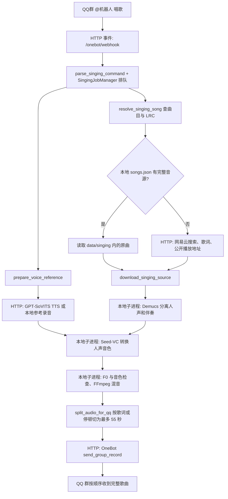

# AI 翻唱（本地 Seed-VC）

AI 翻唱走独立本地后端：Demucs `htdemucs_ft` 先从原曲分离人声，Seed-VC v1 的 F0 44.1 kHz 模型转换人声音色，保留旋律间隔和节奏，也可按角色调整整体音区，再与伴奏混合。现有 GPT-SoVITS 角色权重用于文字转语音，不能直接作为这个歌声转换模型。

运行依赖、Seed-VC 源码、原始录音、训练集、检查点和候选登记都保存在 `data/singing/`。该目录受 Git 忽略；不要将源录音、模型检查点或拆分出的人声提交到 GitHub。旧 GPT-SoVITS 环境只提供 CUDA PyTorch 导入路径，安装脚本会把其它依赖放在单独的歌声运行环境中，不修改 `.env` 或旧环境。

## 请求如何流转



| 代码中的名字 | 中文含义 | 通信边界 |
| --- | --- | --- |
| `onebot_webhook` | 收到 QQ 群事件的入口 | NapCat 向本地 FastAPI 发 HTTP 请求 |
| `SingingJobManager` | 控制翻唱排队、冷却与取消 | 机器人进程内管理；同一时间只放行一个 GPU 任务 |
| `resolve_singing_song` / `download_singing_source` | 确认歌曲、时间轴歌词和完整原曲；取得原曲文件 | 访问网易云公开 HTTP 接口或读取 `data/singing/` 本地文件 |
| `prepare_voice_reference` | 准备角色音色参考录音 | 调用 GPT-SoVITS HTTP TTS，或读取角色已配置的本地录音 |
| `convert_vocals` | 根据原唱人声的旋律转换音色 | 启动本地 Seed-VC 子进程；已验收微调权重作为可选输入 |
| `check_cover_quality` | 检查音高、音色、时长与音量，失败时可重试一次 | 启动本地 RMVPE/CAMPPlus 检查脚本，读取 JSON 报告 |
| `split_audio_for_qq` | 按歌词位置或低能量停顿连续切段 | 本地 FFmpeg 与 WAV 文件操作，单段最多 55 秒 |
| `send_group_record` | 按顺序发送各段语音 | 机器人向 NapCat OneBot HTTP Server 发请求 |

## 启用与群聊用法

安装完成后，在 `.env` 设置 `SINGING_ENABLED=true`。默认运行路径由 `SINGING_PYTHON`、`SINGING_SEED_ROOT`、`SINGING_FFMPEG_PATH`、`SINGING_FFPROBE_PATH` 指定；默认值均已列在 `.env.example`。使用已有 GPT-SoVITS 训练音色合成短参考句时，保持 `SINGING_USE_TRAINED_TTS_REFERENCE=true`，并确保 `VOICE_ENABLED=true`、`VOICE_PROVIDER=gpt_sovits` 及原有语音服务可用。如果只用角色的 `ref_audio_path` 本地录音，设 `SINGING_USE_TRAINED_TTS_REFERENCE=false`。

丛雨默认以真实游戏录音作为翻唱参考，由 `SINGING_REAL_REFERENCE_PROFILE_IDS=murasame` 指定。其它角色仍遵循上述 TTS 参考设置。为翻唱单独选择录音时，可设置 `SINGING_REFERENCE_AUDIO_BY_PROFILE_JSON`，例如 `{"murasame":"data/singing/acceptance/cute-references/murasame_soft_affection_0055_mono44k.wav"}`；路径相对项目根目录，此设置仅供翻唱使用。

| 主要 `.env` 项 | 默认值 | 作用 |
| --- | --- | --- |
| `SINGING_HF_OFFLINE` | `false` | 首次下载模型后可设为 `true`，避免每次转换重新向 Hugging Face 检查缓存；仅影响歌声模型加载 |
| `SINGING_CHUNK_SECONDS` | `55` | QQ 单段上限，配置也不能超过 55 秒 |
| `SINGING_MAX_SONG_SECONDS` | `600` | 原曲实际时长上限，超出时停止 |
| `SINGING_MAX_SOURCE_BYTES` | `104857600` | 本地或公开原曲大小上限（100 MiB） |
| `SINGING_QUEUE_SIZE` / `SINGING_COOLDOWN_SECONDS` | `3` / `120` | 待处理队列和同一用户再次提交的冷却秒数 |
| `SINGING_DIFFUSION_STEPS` / `SINGING_INFERENCE_CFG_RATE` | `35` / `0.7` | Seed-VC 初次转换参数 |
| `SINGING_SEMITONE_SHIFT_BY_PROFILE_JSON` | `{}` | 角色到人声移调半音数的映射，整数 −12 到 +12；未配置角色使用原调 |
| `SINGING_MODEL_TIMEOUT_SECONDS` / `SINGING_JOB_TIMEOUT_SECONDS` | `900` / `2400` | 单个模型子进程与整项任务的超时秒数 |
| `SINGING_SEGMENT_PAUSE_SECONDS` | `1.5` | 相邻 QQ 语音段的发送间隔秒数 |

```text
@机器人 唱歌 朋友的酒DJ版 / 泽亦轩
@机器人 翻唱 芳乃 春泥棒 / ヨルシカ
@机器人 翻唱 芳乃 Shape of You / Ed Sheeran
@机器人 唱歌音色
@机器人 唱歌状态
@机器人 取消唱歌
```

`唱歌` 使用当前选中的角色；`翻唱 角色名` 临时指定角色。也接受 `/唱歌`、`/翻唱`、`/sing`、`/cover`。歌名与歌手名用 `/` 分开可避免同名歌曲选错。DJ 版等特殊版本要在歌名中明确写出；普通歌名不会自动选 DJ 版。歌曲无公开完整音源、只提供试听、缺少时间轴歌词或超过 `SINGING_MAX_SONG_SECONDS`（默认 600 秒）时会停止，并说明原因。

上述日文和英文命令是输入格式示例，不保证音乐平台当前提供可用的免费完整音源；若只返回试听片段，机器人不会生成该曲的“整首翻唱”。

本地已有完整原曲时，可在 `data/singing/songs.json` 用网易云歌曲 ID 登记它。例如 `{"1939837729": {"path": "acceptance/friends-dj/original.mp3", "lyrics_path": "acceptance/friends-dj/lyrics.lrc"}}`。路径相对 `data/singing/`，也允许该目录内的绝对路径；文件和软链接都不能越出该目录。`lyrics_path` 可省略，省略时仍向网易云读取 LRC。此映射只在找到同一歌曲 ID 后使用。

## 安装

运行安装脚本会在需要时克隆官方 Seed-VC 仓库到 `data/singing/runtime/seed-vc`，并把检出的 commit 写入 `data/singing/runtime/seed-vc.commit` 固定本地版本：

```powershell
powershell -ExecutionPolicy Bypass -File .\scripts\setup_singing.ps1
```

默认使用 `qq-chatrobot-voice/GPT-SoVITS/.venv` 中已存在的 CUDA PyTorch，并确认 CUDA 可用；不能选 `.venv_cpu`。只创建一个共享 CUDA 环境的 `.pth` bridge，其他 Python 包安装在 `data/singing/runtime/.venv`。FFmpeg 和 ffprobe 放在 `data/singing/runtime/bin/`；已有可运行版本只做版本检查，新下载的固定版本会校验 SHA-256。第一次运行会下载 Seed-VC / Demucs 所需的预训练模型，需要网络与足够的磁盘空间。

若机器全局配置的 Hugging Face 镜像不可用，训练子进程默认直连官方 `https://huggingface.co`，不会改动全局设置。需要指定镜像时可设置 `SINGING_HF_ENDPOINT`。

## 每角色训练

先查看会读取的角色清单和参考录音：

```powershell
..\qq-chatrobot-voice\GPT-SoVITS\.venv\Scripts\python.exe .\scripts\train_singing_voices.py --profile yoshino --dry-run
```

第一次运行一个小步数候选：

```powershell
data\singing\runtime\.venv\Scripts\python.exe .\scripts\train_singing_voices.py --profile yoshino --run-name yoshino-svc-round1 --max-steps 100
```

首轮训练读取与当前 Seed-VC 推理相同的 Hugging Face 配置和 `...ema_v2.pth` 预训练权重（优先复用 `data/singing/runtime/seed-vc/checkpoints/` 中的本地缓存），并检查 F0、44.1 kHz 与关键张量形状；缺少或不匹配时会停止，不从随机权重开始。仓库内同名的旧 preset 只补足 `timbre_shifter` 等训练专用字段，不决定模型宽度或 Whisper 版本。

检查损失和候选模型后，可用相同 run name 与 `--resume` 从该 run 最新权重再训一轮。Seed-VC 上游训练器固定以 `load_only_params=True` 载入权重，因此这属于**权重热启动**：优化器、epoch 和步数都会重置；`--max-steps 100` 表示本轮再运行 100 步，并不会接续上轮的累计步数或学习率状态。数据集、模型和检查点按角色和 run name 隔离；每轮的 `--max-steps` 可选 `100`、`300` 或 `1000`。旧架构的 run config 会被拒绝，应使用新的 run name。

```powershell
data\singing\runtime\.venv\Scripts\python.exe .\scripts\train_singing_voices.py --profile yoshino --run-name yoshino-svc-round1 --max-steps 300 --resume
```

角色 ID 使用当前 `VOICE_PROFILES_JSON` 的配置：`murasame`、`yoshino`、`mako`、`aimisi`、`lena`、`roka`、`koharu`。脚本只读取该角色已有训练清单中的音频，规范化为单声道 44.1 kHz WAV；大于 30 秒的音频会切成 25 秒片段，短于 1 秒或无法解码的片段会跳过。需要显式指定清单时，使用 `--manifest` 和对应的 `--audio-root`。仅有参考音频而没有训练清单时会停止，避免把单条参考录音误当完整训练集。

运行完成后，候选权重只写到独立的 `data/singing/candidates.json`，状态为 `candidate_requires_human_review`、`accepted=false`。因此不会覆盖现有角色唱歌配置，也不会自动接入机器人。经过听测选择后，先把检查点和配置复制到独立的已选版本目录，避免后续训练改写当前正在使用的文件；再将这两个路径登记到 `data/singing/voices.json`，并设置 `accepted=true`、`status=accepted`。同一 `run-name` 可用 `--resume` 训练多轮并更新候选条目；若同一角色存在另一个 run 的候选，脚本会停止，保留该候选供人工归档。

## 数据和验收边界

现有日语角色训练集约每角色 10–11 条、43–49 秒，爱弥斯约 15 条、85 秒；丛雨日语清单约 53 条。Seed-VC 官方训练说明建议训练音频尽量干净，单条 1–30 秒，并指出数据越多通常效果越好。这些短小的口语素材可能不足以稳定地提升歌声音色；多轮微调也可能过拟合、损伤辅音或改变音色。先用未微调的 Seed-VC 歌声模型与每角色现有参考录音做零样本对照，再逐轮听测候选。现有参考录音经本地解码检查为 4.68–7.73 秒，但“可解码”不代表唱腔音色或训练效果通过验收。

转换时启用 F0 条件，`auto-f0-adjust=false`，默认半音偏移为 `0`。如果原曲音区不适合角色，可设置 `SINGING_SEMITONE_SHIFT_BY_PROFILE_JSON={"murasame":12}`：人声提高一个八度，保留旋律间隔和节奏，伴奏仍用原调。非八度移调时，伴奏自动移到等价的最近调号，例如人声 +3、伴奏 +3；人声 +9、伴奏 −3。伴奏移调用 CPU 上的 librosa 保持声道数和速度，模型仍从角色参考录音生成音色。QQ 发送前会说明人声音区的调整。

转换后，`check_singing_quality.py` 用 RMVPE 比较原唱人声与转换人声的逐帧 F0（最多校正 100 毫秒固定延迟），用 CAMPPlus 比较多个 5–10 秒窗口的音色向量，并检查时长、音量和削波。默认验收阈值为音高中位偏差 **小于 100 cents**、一半音内比例至少 **0.70**、有声帧召回至少 **0.70**、时长误差不超过 **3%**、RMS 大于 **1e-4**、削波比例小于 **0.01**、目标音色余弦相似度至少 **0.35**。未通过时会增加 15 个 diffusion steps 重试一次；报告写入当前任务目录的 `quality.json` 或 `quality_retry.json`。`SINGING_MAX_PITCH_ERROR_CENTS` 与 `SINGING_MIN_VOICE_SIMILARITY` 可调整对应门槛，但不应靠调阈值掩盖走调。指标只能筛出明显问题，实际歌曲的自然度、咬字和音色仍需听辨。

比较角色身份时，听审 CLI 可传 `--identity-reference` 指定另一条真实角色录音；报告的 `voice_similarity` 仍指生成时的参考，而 `identity_reference_similarity` 指这条独立录音。不同版本应使用相同的独立录音才能比较；独立于转换参考不等于训练未见，需另行核对训练清单。报告同时提供有声帧 precision、原唱及转换后的有声音高中位数，辅助检查额外出现的有声帧和音区差异；这些诊断指标不能证明声音像原角色。

试听对照时，`run_singing_model.py --semitone-shift 3` 可显式升 3 个半音，允许范围为 −12 到 +12，默认 0。质量检查需同步传 `check_singing_quality.py --expected-semitone-shift 3`。正式生成链会自动把同一角色设置传给转换、检查和伴奏处理，重试也保留该设置；报告分别记录人声和伴奏的半音偏移。旋律检查比较预期移调后的原唱 F0，不会把正常的角色音区调整误判为走调。

一首完整歌曲会在本地混音后，按歌词时间点或低能量停顿连续切成最长 `SINGING_CHUNK_SECONDS`（默认且最高 55）秒的语音，按顺序发送，不截掉结尾。已发送任务最近 5 份 `cover.wav`、`lyrics.lrc` 和质量报告保存在 `data/singing/results/` 供本地听审；中间人声、伴奏和原曲下载文件会清理。

本地训练需要 RTX 4060 笔记本的 CUDA 环境，实际耗时随模型缓存、批次和音频时长变化。Seed-VC 仓库的 T4 100 步速度仅是上游参考，不能视为本机训练时间保证。

## 上游

- [Seed-VC](https://github.com/Plachtaa/seed-vc)：歌声转换模型、F0 条件、微调配置与训练程序。该仓库已归档，依赖版本按本项目 requirements 固定。
- [FFmpeg Windows binaries in the RVC Hugging Face repository](https://huggingface.co/lj1995/VoiceConversionWebUI/tree/main)：安装脚本使用固定修订版，并对 ffmpeg 与 ffprobe 都做 SHA-256 校验。

## 本地生成与批量训练

先生成完整的本地听审文件，命令不会向 QQ 群发送消息；输出目录必须尚不存在且位于 `data/singing` 内：

```powershell
.venv\Scripts\python.exe scripts/generate_singing_sample.py --query "朋友的酒DJ版" --profile murasame --output data/singing/acceptance/friends-dj-sample
```

输出包含完整 `cover.wav`、QQ 用的 `chunks/`、歌词及 `report.json`。歌曲是否提供完整音源由曲目授权状态决定；中文、日文、英文示例命令都能被解析，部分曲目需要你登记已有完整原曲后才能生成。

批量训练默认依次处理当前 7 个角色，每轮 100 steps，共 2 轮。所有 GPU 任务串行运行，某角色失败会记录并继续其它角色：

```powershell
data\singing\runtime\.venv\Scripts\python.exe scripts/train_all_singing_voices.py
```

只训练丛雨两轮：

```powershell
data\singing\runtime\.venv\Scripts\python.exe scripts/train_all_singing_voices.py --profiles murasame --rounds 2 --max-steps 100
```

批量运行固定使用 `<profile>-svc-batch` 的 run 名，重复运行时延续已保存的模型权重。其它 run 的候选或已经验收的候选会被保留并报告冲突。结果只写入 `data/singing/candidates.json`，不会自动替换机器人使用的音色。
